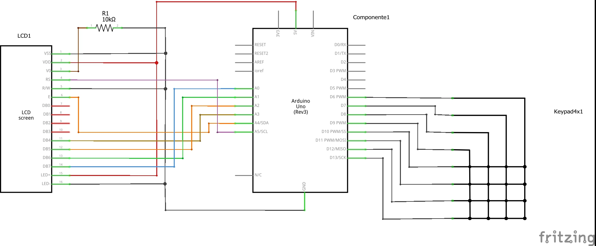

# Calculator

This code convert the Arduino Uno in a simple calculator which can add, subtract, multiply and divide two different numbers.
   
## Hardware

To implement this project is necessary have:

 - Arduino UNO 
 - Module LCD 1602
 - keypad 4x48
  
## Software
 
To implement this project is necessary install the Arduino IDE with the libraries Keypad and Liquidcristal

## Schematic

 

## Videos

In the next video you can see how work the circuit:

